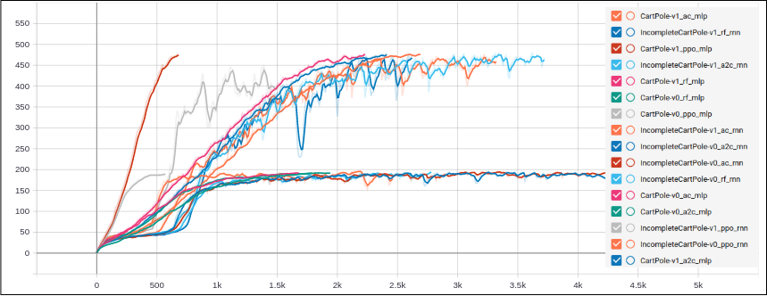

# rlx: A modular Deep RL library for research

#### [Under active development]

## Introcution

`rlx` is a Deep RL library written on top of PyTorch & built for *educational and research* purpose. Majority of the libraries/codebases for Deep RL are geared more towards reproduction of state-of-the-art algorithms on very specific tasks (e.g. Atari games etc.), but `rlx` is NOT. It is supposed to be more expressive and modular. Rather than making RL algorithms as black-boxes, `rlx` adopts an API that tries to expose more granular operation to the users which makes writing new algorithms easier. It is also useful for implementing task specific engineering into a known algorithm (as we know RL is very sensitive to small implementation engineerings).

Concisely, `rlx` is supposed to

1. Be generic (i.e., can be adopted for any task at hand)
2. Have modular lower-level components exposed to users
3. Be easy to implement new algorithms

For the sake of completeness, it also provides few popular algorithms as baseline (more to be added soon). Here's a basic example of PPO (with clipping) implementation with `rlx`

```
base_rollout = agent(policy).episode(horizon) # sample an episode as a 'Rollout' object
base_rewards, base_logprobs = base_rollout.rewards, base_rollout.logprobs # 'rewards' and 'logprobs' for all timesteps
base_returns = base_rollout.mc_returns() # Monte-carlo estimates of 'returns'

for _ in range(k_epochs):
    rollout = agent(policy).evaluate(base_rollout) # 'evaluate' an episode against a policy and get a new 'Rollout' object
    logprobs, entropy = rollout.logprobs, rollout.entropy # get 'logprobs' and 'entropy' for all timesteps
    values, = rollout.others # .. also 'value' estimates

    ratios = (logprobs - base_logprobs.detach()).exp()
    advantage = base_returns - values
    policyloss = - torch.min(ratios, torch.clamp(ratios, 1 - clip, 1 + clip)) * advantage.detach()
    valueloss = advantage.pow(2)
    loss = policyloss.sum() + 0.5 * valueloss.sum() - entropy.sum() * 0.01

    agent.zero_grad()
    loss.backward()
    agent.step()
```

This is all you have to write to get PPO running.

## Design and API

User needs to provide a parametric function that defines the computation at *each time-step* and follows a specific signature (i.e., `rlx.Parametric`). `rlx` will take care of the rest e.g., tie them up to form full rollouts, preserving recurrence (it works seamlessly with recurrent policies) etc.

```
class PolicyValueModule(rlx.Parametric):
    """ Recurrent policy network with state-value (baseline) prediction """

    def forward(self, *states):
    	# Recurrent state from the last time-step will come in automatically
        recur_state, state = states
        ...
        action1 = torch.distributions.Normal(...)
        action2 = torch.distributions.Categorical(...)
        state_value = self.state_value_net(...)
        return next_recur_state, rlx.ActionDistribution(action1, action2, ...), state_value

network = PolicyValueModule(...)
```

While the `next_recur_state` and `state_value` are optional (i.e., can be `None`), a multi-component action distribution needs to be returned. `rlx` will take care of sampling from it and computing log-probabilities. The first two return values are necessary, the rest are optional. You can return any number of quantity after first two arguments as *extras* - they will all be tracked.

---

The design is centered around the primary data structure `Rollout` which can hold a sequence of experience tuples `(state, action, reward)`, action distributions and any arbitrary quantity returned from the `rlx.Parametric.forward()`. `Rollout` internally keeps track of the computation graph (if necessary/requested). One has to sample a `Rollout` instance by running the agent in the environment. The rollout can then provide quantities like log-probs and anything else that was tracked, upon request.

```
with torch.set_grad_enabled(...):
	rollout = agent(network).episode(..., dry=False)
	rollout.mc_returns() # populate its 'returns' property to naive Monte-Carlo returns
	logprobs, returns = rollout.logprobs, rollout.returns
	values, = rollout.others # any 'extra' quantity computed will be available as rollout.others
```

We can enable/disable gradients by the pytorch way (i.e., `torch.set_grad_enabled(..)` etc.).

The flag `dry=True` means the rollout instance will only hold `(state, action, reward)` tuples and nothing else. This design allows the rollouts to be re-evaluated against another policy - as required by some algorithms (like PPO). Such rollouts cannot offer logprobs.

```
# 'rollout' is not dry, it has computation graph attached
rollout = agent(other_policy).evaluate(dry_rollout)
```

This API has another benefit. One can sample an episode from a policy in dry-mode, then `.vectorize()` it and re-evaluate it against the same policy. This bring in computational benefits.

```
with torch.no_grad():
	dry_rollout = agent(policy).episode(..., dry=Try)
dry_rollout_vec = dry_rollout.vectorize() # internally creates a batch dimension for efficient processing
rollout = agent(policy).evalue(dry_rollout_vec)
```

If the rollout is not dry and gradients were enabled, one can directly do a backward pass

```
loss = (rollout.logprobs * rollout.returns).mean()
loss.backword()
```

---

As you might have noticed, the network is not a part of the agent. In fact, the agent only has a copy of the environment and nothing else. One needs to *augment* the agent with a network in order for it to sample episode. This design allows us to easily run the agent using a different policy, for example, a "behavior policy" in off-policy RL

```
behaviour_rollout = agent(behavior_policy).episode(...)
behaviour_logprobs = behaviour_rollout.logprobs # record them for computing importance ratio afterwards
```

---

`Rollout` has a nice API which is useful for writing customized algorithm or implementation tricks. We can

```
# shuffle rollouts ..
rollout.shuffle()

# .. index/slice them
rollout[:-1] # remove the end-state
rollout[:100] # recurrent rollouts can be too long (RNNs have long-term memory problems)

# .. or even concat them
(rollout1 + rollout2).vectorize()
```


NOTE: I will write more docs if get time. Follow the algorithm implementations at `rlx/algos/*` for more API usage.

## Installation and usage

Right now, there is no `pip` package, its just this repo. You can install it by cloning it and doing
```
pip install .
```

For example usage, follow the `main.py` script. You can test an algorithm by
```
python main.py --algo ppo --policytype rnn --batch_size 16 --max_episode 5000 --horizon 200 --env CartPole-v0 --standardize_return
```

The meaning of batch-size is a little different here. It means on how many rollouts the gradient will be averaged (Currently that's how its done).

## Experiments

- Basic environments

The "Incomplete"-prefixed environments are examples of POMDP. Their state representations have been masked to create partial observability. They can be only be solved by recurrent policies.



- A little modified (simplified) `SlimeVolleyGym-v0` environment by David Ha [https://github.com/hardmaru/slimevolleygym](https://github.com/hardmaru/slimevolleygym). An MLP agent trained with PPO learns to play volleyball by self-play experiences, provided at `examples/slime.py`.


---

## Plans

Currently `rlx` has following algorithms, but it is **under active development**.

1. Vanilla REINFORCE
2. REINFORCE with Value-baseline
3. A2C
4. PPO with clipping
5. OffPAC

#### TODO:

1. More SOTA algorithms (DQN, DDPG, etc.) to be implemented
2. Create a uniform API/interface to support Q-learning algorithm
3. Multiprocessing/Parallelization support

#### Contributions

You are more than welcome to contribute anything.